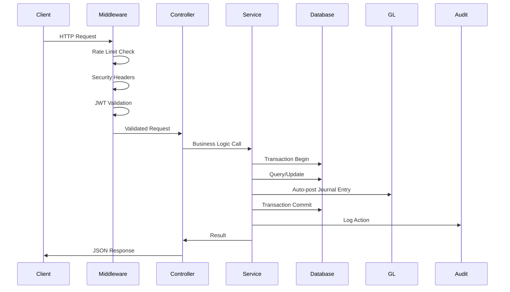

# Nivas PMS - Architecture Documentation

## 1. System Overview & Core Architecture

### System Purpose
Nivas PMS (Property Management System) is a comprehensive multi-tenant Hotel Operating System designed for the hospitality industry. It provides end-to-end management capabilities including reservations, front desk operations, food & beverage ordering, housekeeping, inventory, procurement, HR, and a full double-entry General Ledger accounting system tailored for Nepal's regulatory requirements (VAT, fiscal years, Nepali dates).

### Core Architectural Pattern
**Modular Monolith with Service Layer Pattern**

The system follows a modular monolithic architecture where business logic is organized into domain-specific modules (finance, bookings, orders, inventory, etc.). Each module contains:
- **Controller Layer**: HTTP endpoint definitions using Elysia framework
- **Service Layer**: Business logic implementation with transaction management
- **Shared Utilities**: Cross-cutting concerns (logging, errors, PDF generation)

### Primary Tech Stack

#### Backend (`nivas-backend/`)
- **Runtime**: Bun (high-performance JavaScript runtime)
- **Framework**: Elysia (TypeScript-first web framework)
- **Database**: PostgreSQL with Drizzle ORM
- **Caching**: Redis (via ioredis)
- **Object Storage**: MinIO (S3-compatible)
- **Authentication**: JWT via @elysiajs/jwt
- **Real-time**: WebSockets via @elysiajs/websocket
- **Scheduling**: Croner (cron job scheduling)
- **PDF Generation**: pdfmake
- **Regional**: nepali-date-converter (Bikram Sambat calendar support)
- **Validation**: Zod
- **Logging**: Pino with pino-pretty

#### Frontend (`nivas-frontend/`)
- **Framework**: React 19 with TypeScript
- **Styling**: TailwindCSS v4
- **State Management**: TanStack React Query (server state)
- **UI Components**: Custom component library with shadcn/ui patterns
- **Drag & Drop**: @dnd-kit/core, @hello-pangea/dnd
- **Charts**: Recharts
- **Animations**: Framer Motion
- **Date Handling**: react-datepicker
- **Notifications**: Sonner (toast notifications)
- **Icons**: Lucide React

#### Infrastructure
- **Containerization**: Docker & Docker Compose
- **Database Migrations**: Drizzle Kit
- **Process Management**: Bun's built-in hot reload for development

---

## 2. Directory Structure & Core Modules

### Root Structure
```
development/
├── nivas-backend/          # Backend API server
├── nivas-frontend/         # React frontend application
├── .agents/                # AI agent configurations
├── .claude/                # Claude AI settings
├── .cursor/                # Cursor IDE settings
├── docker-compose.yml      # Development environment
├── docker-compose.prod.yml # Production environment
├── CLAUDE.md              # AI assistant instructions
├── DOC.md                 # API documentation
└── SETUP.md               # Setup instructions
```

### Backend Structure (`nivas-backend/`)
```
src/
├── config/                # Environment configuration
│   └── env.ts            # Database, Redis, MinIO, JWT settings
├── db/                    # Database layer
│   ├── index.ts          # Database connection pool
│   └── schema.ts         # Drizzle ORM schema definitions (2000+ lines)
├── middlewares/           # HTTP middleware
│   ├── error.middleware.ts      # Global error handling
│   ├── rate-limit.middleware.ts # Rate limiting
│   ├── security.middleware.ts   # Security headers
│   └── idempotency.middleware.ts # Idempotency for retries
├── modules/               # Domain modules (28+ modules)
│   ├── finance/          # ★ CRITICAL: Financial operations
│   ├── bookings/         # Reservation management
│   ├── orders/           # F&B orders & KOT
│   ├── inventory/        # Stock management & procurement
│   ├── rooms/            # Room & room type management
│   ├── iam/              # Identity & Access Management
│   ├── hr/               # Human resources & payroll
│   ├── housekeeping/     # Housekeeping tasks
│   ├── maintenance/      # Asset maintenance
│   ├── communications/   # Messaging system
│   ├── notifications/    # Real-time notifications
│   ├── analytics/        # Business intelligence
│   ├── reports/          # Financial & operational reports
│   ├── revenue/          # Dynamic pricing & yield management
│   ├── events/           # Banquet & event management
│   ├── corporate/        # Corporate account management
│   ├── crm/              # Guest relationship management
│   ├── menu/             # Restaurant menu management
│   ├── operations/       # Facilities, tables, layout
│   ├── procurement/      # Purchase orders & vendors
│   ├── scheduler/        # Background job scheduler
│   ├── sync/             # Flutter offline sync
│   ├── system/           # Audit logs, night audit
│   ├── tenants/          # Multi-tenant operations
│   ├── settings/         # Hotel configuration
│   ├── storage/          # File upload/download
│   ├── super-admin/      # SaaS platform management
│   └── saas/             # Subscription & billing
├── shared/               # Shared utilities
│   └── logger.ts         # Pino logger configuration
├── types/                # TypeScript type definitions
├── utils/                # Utility functions
│   ├── errors.ts         # Custom error classes
│   ├── pdf.service.ts    # PDF generation
│   └── response.helper.ts # API response formatting
└── index.ts              # Application entry point
```

### Frontend Structure (`nivas-frontend/`)
```
src/
├── components/           # React components
│   ├── auth/            # Authentication components
│   ├── dashboard/       # Dashboard widgets
│   ├── features/        # Feature-specific components
│   ├── layout/          # Layout components (Sidebar, Header)
│   ├── modals/          # Modal dialogs
│   ├── ui/              # Reusable UI components
│   └── widgets/         # Small utility widgets
├── pages/               # Page components (route handlers)
│   ├── finance/         # Financial management pages
│   ├── bookings/        # Reservation pages
│   ├── orders/          # F&B order pages
│   ├── inventory/       # Inventory management pages
│   ├── rooms/           # Room management pages
│   ├── staff/           # Staff management pages
│   ├── reports/         # Report pages
│   └── settings/        # Configuration pages
├── lib/                 # Utility libraries
├── styles/              # Global styles
├── App.tsx              # Root component
└── index.ts             # Entry point
```

### Module Interactions

**Core Data Flow:**
1. **Bookings Module** → Creates reservations, links to rooms and guests
2. **Orders Module** → F&B orders linked to bookings/rooms
3. **Finance Module** → Processes payments, generates invoices, posts to GL
4. **Inventory Module** → Manages stock, procurement via purchase orders
5. **HR Module** → Manages staff, attendance, payroll computation
6. **System Module** → Audit logging, night audit jobs

**Cross-Module Dependencies:**
- Finance depends on Bookings (for invoicing)
- Finance depends on Orders (for F&B revenue)
- Bookings depends on Revenue (for dynamic pricing)
- All modules depend on System (for audit logging)
- All modules depend on IAM (for authorization)

---

## 3. Data Flow & State Management

### Request Lifecycle



### Typical User Request Flow

**Example: Guest Checkout Process**

1. **Frontend Request**: `POST /api/v1/finance/checkout` with booking ID and payment data
2. **Middleware Layer**:
   - Rate limiting check (per hotel)
   - JWT validation (extract user ID, hotel ID)
   - Security headers validation
3. **Controller Layer** (`checkout.controller.ts`):
   - Validates request schema using Zod
   - Extracts user context from JWT
   - Calls `CheckoutService.process()`
4. **Service Layer** (`checkout.service.ts`):
   - **Transaction Begin**: Opens database transaction
   - **Billing Calculation**: Calls `BillingService.calculateBillingSummary()`
   - **Payment Recording**: Inserts payment records
   - **Invoice Generation**: Calls `InvoiceService.generateInvoice()`
   - **GL Posting**: Auto-posts journal entries via `GLService.postJournalEntry()`
   - **Room Status Update**: Marks room as CLEANING
   - **Booking Status Update**: Marks booking as CHECKED_OUT
   - **Transaction Commit**: Commits all changes atomically
   - **Audit Logging**: Logs CHECKOUT action with metadata
5. **Database Layer**:
   - Executes SQL via Drizzle ORM
   - Maintains referential integrity
   - Updates indexes
6. **Response**: Returns checkout result with invoice details

### State Management

**Backend State:**
- **Database State**: PostgreSQL as single source of truth
- **Cache State**: Redis for session data, rate limiting counters
- **File State**: MinIO for document storage (invoices, receipts)
- **Job State**: Background jobs table for deferred tasks

**Frontend State:**
- **Server State**: TanStack Query caches API responses with automatic refetching
- **Client State**: React useState/useReducer for UI state
- **URL State**: Route parameters for filtering/pagination
- **Local Storage**: User preferences, theme settings

### Transaction Management

All critical operations use database transactions to ensure ACID properties:

```typescript
// Example from checkout.service.ts
const result = await db.transaction(async (tx) => {
    // 1. Record payments
    const [payment] = await tx.insert(payments).values({...}).returning();
    
    // 2. Generate invoice
    const { invoice } = await InvoiceService.generateInvoice(hotelId, userId, data, tx);
    
    // 3. Post GL entries
    await GLService.postJournalEntry(hotelId, userId, date, desc, ref, lines, tx);
    
    // 4. Update booking status
    await tx.update(bookings).set({ status: 'CHECKED_OUT' }).where(...);
    
    // All changes commit atomically or rollback together
    return { invoice, payment };
});
```

### Data Consistency Mechanisms

1. **Advisory Locks**: Used for invoice number generation to prevent duplicates
   ```typescript
   await tx.execute(sql`SELECT pg_advisory_xact_lock(${hotelId})`);
   ```

2. **Foreign Key Constraints**: Database-level referential integrity

3. **Unique Constraints**: Prevent duplicate records (e.g., invoice numbers, order numbers)

4. **Audit Logging**: All mutations logged to `audit_logs` table for traceability

5. **Idempotency Middleware**: Prevents duplicate processing of retry requests

---

## 4. Deep Dive: Finance Modules (CRITICAL FOCUS)

### Finance Module Architecture

The finance module is the most complex and critical subsystem, implementing a full double-entry General Ledger (GL) system with automatic posting, Nepal-specific tax calculations, and comprehensive audit trails.

```
nivas-backend/src/modules/finance/
├── accounting.controller.ts     # GL account management endpoints
├── accounting.service.ts        # Chart of accounts operations
├── billing.controller.ts        # Billing summary endpoints
├── billing.service.ts           # ★ Centralized billing calculations
├── checkout.service.ts          # ★ Complete checkout workflow
├── credit-note.service.ts       # Invoice voiding with GL reversal
├── credit-notes.controller.ts   # Credit note endpoints
├── finance.service.ts           # Payment recording & voiding
├── folio.controller.ts          # Guest folio endpoints
├── folio.service.ts             # Folio charge management
├── gl.controller.ts             # General Ledger endpoints
├── gl.service.ts                # ★ Journal entry & trial balance
├── invoice.service.ts           # ★ Invoice generation & PDF
├── invoices.controller.ts       # Invoice endpoints
├── payments.controller.ts       # Payment endpoints
├── reports.service.ts           # Financial reports
├── shift.service.ts             # Cash shift management
├── shifts.controller.ts         # Shift endpoints
├── tally.service.ts             # Tally integration (export)
└── tax-rates.controller.ts      # Tax rate configuration
```

### Core Finance Data Models

#### General Ledger (GL) Tables

**accounts** - Chart of Accounts
```typescript
{
  id: serial,
  hotelId: integer,           // Multi-tenant isolation
  code: text,                 // Account code (e.g., '1000', '1100')
  name: text,                 // Account name (e.g., 'Cash', 'Accounts Receivable')
  type: enum,                 // ASSET | LIABILITY | EQUITY | REVENUE | EXPENSE
  isControlAccount: boolean,  // Control account flag
  parentId: integer,          // Hierarchical structure
  balance: decimal,           // Current balance
  isActive: boolean
}
```

**journal_entries** - Journal Entry Header
```typescript
{
  id: uuid,
  hotelId: integer,
  date: date,                 // Entry date
  description: text,          // Entry description
  reference: text,            // Reference (invoice number, etc.)
  status: enum,               // POSTED | REVERSED
  createdById: uuid,          // User who created
  reversedById: uuid,         // User who reversed (if applicable)
  createdAt: timestamp
}
```

**journal_lines** - Journal Entry Lines (Double-Entry)
```typescript
{
  id: serial,
  journalEntryId: uuid,       // FK to journal_entries
  accountId: integer,         // FK to accounts
  debit: decimal,             // Debit amount
  credit: decimal,            // Credit amount
  description: text
}
```

**Standard Chart of Accounts** (Auto-initialized for new hotels):
- **1000** - Cash (Asset)
- **1100** - Accounts Receivable (Asset, Control)
- **1200** - Inventory (Asset, Control)
- **2000** - Accounts Payable (Liability, Control)
- **2100** - Sales Tax Payable (Liability, Control)
- **3000** - Owner Equity (Equity)
- **4000** - Room Revenue (Revenue)
- **4100** - F&B Revenue (Revenue)
- **5000** - Cost of Goods Sold (Expense)
- **5100** - Payroll Expense (Expense)
- **5200** - Maintenance Expense (Expense)

#### Billing & Invoicing Tables

**folio_charges** - Guest Folio Charges
```typescript
{
  id: serial,
  hotelId: integer,
  bookingId: uuid,            // Linked to booking
  orderId: uuid,              // Linked to F&B order (optional)
  invoiceId: uuid,            // Linked to invoice (immutable once set)
  date: date,                 // Charge date
  description: text,          // Charge description
  amount: decimal,            // Charge amount
  type: text                  // ROOM_CHARGE | MISCELLANEOUS
}
```

**invoices** - Invoice Headers
```typescript
{
  id: uuid,
  hotelId: integer,
  bookingId: uuid,
  invoiceNumber: text,        // Format: INV-YY/YY-XXXX (e.g., INV-81/82-0001)
  sequenceNumber: integer,    // Sequential within fiscal year
  fiscalYear: text,           // Nepal fiscal year (e.g., '81/82')
  guestName: text,
  guestPan: text,             // Guest PAN number (for VAT)
  subTotal: decimal,
  serviceCharge: decimal,
  vatAmount: decimal,
  discountAmount: decimal,
  grandTotal: decimal,
  paymentStatus: enum,        // PAID | CREDIT
  currency: text,             // Default: NPR
  isVoided: boolean,
  voidReason: text,
  createdById: uuid
}
```

**payments** - Payment Records
```typescript
{
  id: uuid,
  hotelId: integer,
  bookingId: uuid,            // Optional (for room payments)
  orderId: uuid,              // Optional (for F&B payments)
  invoiceId: uuid,            // Optional (for invoice payments)
  amount: decimal,
  paymentMethod: enum,        // CASH | CARD | ESEWA | KHALTI | CONNECT_IPS | UPI | BANK_TRANSFER
  transactionId: text,        // Gateway transaction ID
  notes: text,
  recordedById: uuid
}
```

**credit_notes** - Credit Notes (Invoice Voiding)
```typescript
{
  id: uuid,
  hotelId: integer,
  originalInvoiceId: uuid,    // FK to invoices
  creditNoteNumber: text,     // Format: CN-YY/YY-XXXX
  fiscalYear: text,
  sequenceNumber: integer,
  reason: text,
  amount: decimal,
  createdById: uuid
}
```

### Finance Business Logic

#### 1. Billing Service (`billing.service.ts`)

**Purpose**: Centralized billing calculation logic used across checkout, guest portal, and reporting.

**Key Calculations**:
```typescript
// Billing Summary Calculation
subTotal = roomCharge + ordersTotal
serviceCharge = subTotal * serviceChargeRate (default: 10%)
vat = (subTotal + serviceCharge) * taxRate (default: 13%)
grandTotal = subTotal + serviceCharge + vat
dueAmount = grandTotal - paidAmount
```

**Data Sources**:
- **Room Charges**: Sum of `folio_charges` for the booking (night audit + manual charges)
- **F&B Charges**: Sum of `orders.totalAmount` where status = 'SERVED'
- **Payments**: Sum of `payments.amount` for the booking

**Special Logic**:
- Falls back to `booking.totalAmount` if no folio charges exist (e.g., before first night audit)
- Only includes SERVED orders (excludes PENDING, CANCELLED, PREPARING)

#### 2. General Ledger Service (`gl.service.ts`)

**Purpose**: Implements double-entry accounting with automatic journal posting.

**Core Operations**:

**a) Initialize Chart of Accounts**
```typescript
async initializeChartOfAccounts(hotelId: number) {
    // Creates standard accounts (1000-5200)
    // Idempotent: skips if already exists
}
```

**b) Post Journal Entry**
```typescript
async postJournalEntry(hotelId, userId, date, description, reference, lines) {
    // Validation: Debits must equal Credits (±0.01 tolerance)
    // Creates journal_entries header
    // Creates journal_lines for each line
    // All within provided transaction (or new transaction)
}
```

**c) Reverse Journal Entry**
```typescript
async reverseJournalEntry(hotelId, userId, entryId, reason) {
    // Marks original entry as REVERSED
    // Creates reversing entry (swaps debits/credits)
    // Reference format: REV-{original_reference}
}
```

**d) Trial Balance**
```typescript
async getTrialBalance(hotelId, asOfDate) {
    // SQL aggregation: SUM(debits) - SUM(credits) per account
    // Returns account balances as of specified date
    // Only includes POSTED entries
}
```

**GL Auto-Posting Rules** (from DOC.md):

```
Event: room_charge (check-in night)
  DR  Accounts Receivable (guest folio)   100.00
  CR  Room Revenue                         91.74
  CR  VAT Payable (13%)                     8.26

Event: F&B order served
  DR  Accounts Receivable (guest folio)    50.00
  CR  F&B Revenue                          44.25
  CR  VAT Payable (13%)                     5.75

Event: manual payment recorded (cash)
  DR  Cash                                150.00
  CR  Accounts Receivable                 150.00

Event: GRN received (purchase)
  DR  Inventory Asset (WAC updated)        80.00
  CR  Accounts Payable                     80.00

Event: payroll approved
  DR  Salary Expense                     5000.00
  CR  Salary Payable                     5000.00
```

#### 3. Invoice Service (`invoice.service.ts`)

**Purpose**: Invoice generation with fiscal year tracking, immutability, and PDF export.

**Key Features**:

**a) Fiscal Year Management**
```typescript
// Nepal Fiscal Year: Shrawan to Ashad (mid-July to mid-July)
// Bikram Sambat calendar conversion
const fiscalYear = `${(bsYear % 100).toString().padStart(2, '0')}/${((bsYear + 1) % 100).toString().padStart(2, '0')}`;
// Example: '81/82' for FY 2081/2082
```

**b) Sequential Invoice Numbering**
```typescript
// Format: {PREFIX}-{FISCAL_YEAR}-{SEQUENCE}
// Example: INV-81/82-0001, INV-81/82-0002
// Advisory lock prevents duplicate numbers
await tx.execute(sql`SELECT pg_advisory_xact_lock(${hotelId})`);
```

**c) Invoice Immutability**
```typescript
// Once generated, folio charges are linked to invoice
await tx.update(folioCharges)
    .set({ invoiceId: inv.id })
    .where(and(
        eq(folioCharges.bookingId, bookingId),
        sql`${folioCharges.invoiceId} IS NULL`  // Only unattached charges
    ));
```

**d) Auto-GL Posting**
```typescript
// Debit Accounts Receivable
lines.push({ accountId: arAccount.id, debit: finalGrandTotal, credit: 0 });

// Credit Revenue (Subtotal + Service Charge)
const revenueAmt = billingSummary.subTotal + billingSummary.serviceCharge;
lines.push({ accountId: revAccount.id, debit: 0, credit: revenueAmt });

// Credit VAT
if (billingSummary.vat > 0) {
    lines.push({ accountId: taxAccount.id, debit: 0, credit: billingSummary.vat });
}
```

**e) PDF Generation**
```typescript
// Uses pdfmake for server-side PDF generation
// Includes hotel branding, line items, tax breakdown
// Supports both AD (Gregorian) and BS (Bikram Sambat) dates
```

#### 4. Checkout Service (`checkout.service.ts`)

**Purpose**: Complete checkout workflow with billing preview, payment processing, and invoice generation.

**Workflow**:

**a) Preview** (Before checkout)
```typescript
async preview(hotelId, bookingId) {
    // Fetches booking details
    // Calculates billing summary
    // Retrieves folio charges
    // Retrieves served orders
    // Retrieves existing payments
    // Returns itemized bill with balance due
}
```

**b) Process** (Execute checkout)
```typescript
async process(hotelId, userId, bookingId, data) {
    // 1. Record all payments
    // 2. Calculate final balance after payments and discount
    // 3. Generate invoice (within transaction)
    // 4. Update invoice payment status (PAID or CREDIT)
    // 5. Post payment GL entries (Debit Cash/Bank, Credit AR)
    // 6. Mark booking as CHECKED_OUT
    // 7. Mark room as CLEANING
    // 8. Log audit action
    // All atomic within single transaction
}
```

**Credit Handling**:
```typescript
if (data.payLater || remainingBalance > 0.01) {
    isCredit = true;
    await tx.update(invoices)
        .set({
            paymentStatus: 'CREDIT',
            voidReason: `Credit: ${data.creditReason}. Balance due: ${remainingBalance}`
        });
}
```

#### 5. Finance Service (`finance.service.ts`)

**Purpose**: Payment recording, voiding, and customer folio management.

**Key Operations**:

**a) Record Payment**
```typescript
async recordPayment(hotelId, userId, data) {
    // Inserts payment record
    // Smart isPaid: only marks booking paid if cumulative payments >= totalAmount
    // Auto-posts to GL:
    //   - Order payment: Debit Cash/Bank, Credit F&B Revenue
    //   - Booking payment: Debit Cash/Bank, Credit AR
}
```

**b) Void Payment**
```typescript
async voidPayment(hotelId, userId, paymentId, reason) {
    // Creates negative payment record
    // Reverses GL entry (swaps debits/credits)
    // Logs audit action
}
```

**c) Customer Folio**
```typescript
async getCustomerFolio(hotelId, guestId) {
    // Aggregates all bookings for guest
    // Aggregates all orders for guest
    // Retrieves all folio charges
    // Retrieves all payments
    // Calculates total charges, total paid, balance due
}
```

#### 6. Credit Note Service (`credit-note.service.ts`)

**Purpose**: Invoice voiding with complete GL reversal.

**Workflow**:
```typescript
async create(hotelId, userId, data) {
    // 1. Validate invoice exists and not already voided
    // 2. Generate credit note number (CN-YY/YY-XXXX)
    // 3. Create credit note record
    // 4. Mark invoice as voided
    // 5. Post GL reversal:
    //    - Credit AR (reverse original debit)
    //    - Debit Revenue (reverse original credit)
    //    - Debit VAT (reverse original credit)
    //    - Debit Discount (if applicable)
    // 6. Log audit action
}
```

#### 7. Folio Service (`folio.service.ts`)

**Purpose**: Guest folio charge management.

**Operations**:
- **Create Charge**: Add manual charge to booking folio
- **Get Booking Folio**: Retrieve all charges and payments for a booking
- **Update Charge**: Modify charge amount/description
- **Void Charge**: Remove charge with audit log
- **Get Customer Folio**: Aggregate folio across all guest bookings

#### 8. Shift Service (`shift.service.ts`)

**Purpose**: Cash shift management for front desk staff.

**Features**:
- Shift opening with starting float
- Shift closing with cash count
- Variance calculation (expected vs. actual)
- System cash total tracking
- Shift handover support

### Finance Data Validation

**Double-Entry Validation**:
```typescript
// GL Service enforces balanced entries
if (Math.abs(totalDebit - totalCredit) > 0.01) {
    throw new BusinessLogicError(`Journal entry is not balanced`);
}
```

**Invoice Immutability**:
```typescript
// Once folio charges are attached to invoice, they cannot be modified
await tx.update(folioCharges)
    .set({ invoiceId: inv.id })
    .where(sql`${folioCharges.invoiceId} IS NULL`);
```

**Payment Validation**:
```typescript
// Smart isPaid: only mark paid if cumulative payments cover total
if (cumulative >= totalAmt && totalAmt > 0) {
    await tx.update(bookings).set({ isPaid: true });
}
```

### Finance Integrations

**With Bookings Module**:
- Invoices linked to bookings
- Folio charges linked to bookings
- Payments linked to bookings

**With Orders Module**:
- F&B orders included in billing
- Order payments post to F&B Revenue GL account

**With Inventory Module**:
- Purchase orders generate GRN (Goods Received Note)
- GRN posts to GL: Debit Inventory, Credit Accounts Payable

**With HR Module**:
- Payroll computation posts to GL: Debit Salary Expense, Credit Salary Payable

**With System Module**:
- All finance operations logged to audit_logs
- Night audit generates daily revenue summary

### Nepal-Specific Features

**VAT Calculation**:
- Default VAT rate: 13%
- Applied to (subtotal + service charge)
- VAT Payable account tracks liability

**Fiscal Year**:
- Bikram Sambat calendar
- Fiscal year: Shrawan to Ashad (mid-July to mid-July)
- Invoice numbering reset per fiscal year

**Date Handling**:
- Nepali date converter for BS dates
- Dual date display (AD and BS) on invoices

**Tax Compliance**:
- Guest PAN number collection
- VAT breakdown on invoices
- Credit note tracking for tax adjustments

---

## 5. Key Design Decisions & Potential Blind Spots

### Design Patterns

#### 1. Service Layer Pattern
**Implementation**: Each module has a `.service.ts` file containing business logic, separate from `.controller.ts` which handles HTTP concerns.

**Benefits**:
- Clear separation of concerns
- Business logic reusable across different interfaces (API, CLI, webhooks)
- Easier unit testing (mock HTTP layer)

**Example**:
```typescript
// bookings.controller.ts
controller.get('/bookings/:id', async (ctx) => {
    const booking = await BookingsService.getBookingById(hotelId, id);
    return booking;
});

// bookings.service.ts
static async getBookingById(hotelId: number, bookingId: string) {
    // Business logic here
}
```

#### 2. Transaction Script Pattern
**Implementation**: Complex operations (checkout, invoice generation) use database transactions to ensure atomicity.

**Benefits**:
- ACID guarantees for critical operations
- Automatic rollback on errors
- Consistent state even with failures

**Example**:
```typescript
const result = await db.transaction(async (tx) => {
    const payment = await tx.insert(payments).values({...}).returning();
    const invoice = await InvoiceService.generateInvoice(hotelId, userId, data, tx);
    await GLService.postJournalEntry(hotelId, userId, date, desc, ref, lines, tx);
    return { payment, invoice };
});
```

#### 3. Repository Pattern (via Drizzle ORM)
**Implementation**: Drizzle ORM provides type-safe database access with query builders.

**Benefits**:
- Type safety with TypeScript
- SQL generation without raw strings
- Migration support

#### 4. Observer Pattern (Event Handlers)
**Implementation**: Audit and notification handlers registered at startup.

**Benefits**:
- Decoupled side effects
- Easy to add new listeners
- Non-blocking async operations

**Example**:
```typescript
// index.ts
registerNotificationHandlers();
registerAuditEventHandlers();

// audit-event-handlers.ts
export function registerAuditEventHandlers() {
    // Subscribe to audit events
}
```

#### 5. Strategy Pattern (Payment Methods)
**Implementation**: Different payment methods (CASH, CARD, ESEWA, KHALTI) handled via enum and conditional logic.

**Benefits**:
- Extensible for new payment methods
- Consistent interface across methods

### Architectural Strengths

1. **Multi-Tenant Isolation**: All tables include `hotelId` for complete data segregation
2. **Comprehensive Audit Trail**: All mutations logged with user, timestamp, and metadata
3. **Double-Entry Accounting**: Enforced at GL service level with validation
4. **Idempotency**: Middleware prevents duplicate processing of retry requests
5. **Regional Localization**: Built-in support for Nepal (VAT, fiscal years, BS dates)
6. **Modular Structure**: Clear domain boundaries enable independent development
7. **Type Safety**: TypeScript throughout with Drizzle ORM type inference
8. **Transaction Safety**: Critical operations use database transactions
9. **Real-time Capabilities**: WebSocket support for live updates
10. **Background Jobs**: Cron-based scheduler for deferred tasks

### Potential Blind Spots & Technical Debt

#### 1. Test Coverage
**Observation**: No test files visible in the structure (`tests/` directory exists but appears empty).

**Impact**:
- High risk of regressions
- Difficult to refactor with confidence
- Business logic validation relies on manual testing

**Recommendation**:
- Add unit tests for service layer (especially finance calculations)
- Add integration tests for critical workflows (checkout, GL posting)
- Add E2E tests for user journeys

#### 2. Error Handling Granularity
**Observation**: Custom error classes exist (`BusinessLogicError`, `NotFoundError`, `ValidationError`) but error messages may not be user-friendly.

**Impact**:
- Poor user experience for edge cases
- Difficult debugging for support teams

**Recommendation**:
- Standardize error response format
- Add error codes for programmatic handling
- Implement error logging with correlation IDs

#### 3. Database Indexing Strategy
**Observation**: Indexes exist on foreign keys and frequently queried columns, but no composite indexes for complex queries.

**Impact**:
- Potential performance issues for complex reports
- Slow queries on large datasets

**Recommendation**:
- Analyze slow query logs
- Add composite indexes for common query patterns (e.g., hotel + date + status)
- Consider partitioning for large tables (audit_logs, journal_lines)

#### 4. Caching Strategy
**Observation**: Redis is configured but usage appears limited to rate limiting.

**Impact**:
- Repeated database queries for reference data (hotels, room types, menu items)
- No caching of computed results (billing summaries, trial balances)

**Recommendation**:
- Cache reference data with TTL
- Cache expensive computations (billing summaries)
- Implement cache invalidation on data changes

#### 5. API Versioning
**Observation**: API uses `/api/v1/` prefix but no versioning strategy documented.

**Impact**:
- Breaking changes may impact clients
- Difficult to maintain backward compatibility

**Recommendation**:
- Document versioning policy
- Use semantic versioning for breaking changes
- Consider deprecation timeline for old endpoints

#### 6. Pagination Consistency
**Observation**: Some endpoints use limit/offset, others may use cursor-based pagination.

**Impact**:
- Inconsistent API patterns
- Performance issues with deep offset pagination

**Recommendation**:
- Standardize on cursor-based pagination for large datasets
- Document pagination strategy
- Add total count metadata

#### 7. File Upload Security
**Observation**: MinIO is configured for file storage but no visible validation on file types/sizes.

**Impact**:
- Potential security vulnerabilities (malicious uploads)
- Storage cost issues (unlimited file sizes)

**Recommendation**:
- Add file type validation (allowlist)
- Add file size limits
- Implement virus scanning for uploads
- Add storage quotas per hotel

#### 8. Background Job Reliability
**Observation**: Background jobs stored in database but no visible retry mechanism or dead letter queue.

**Impact**:
- Lost jobs on failures
- No visibility into failed jobs
- Manual intervention required

**Recommendation**:
- Implement exponential backoff retry
- Add dead letter queue for failed jobs
- Add job monitoring dashboard
- Implement job timeout handling

#### 9. Database Connection Pooling
**Observation**: Database connection configuration not visible in schema.

**Impact**:
- Potential connection exhaustion under load
- Poor performance with improper pool sizing

**Recommendation**:
- Document connection pool configuration
- Monitor connection pool metrics
- Implement connection health checks

#### 10. Secret Management
**Observation**: `.env` files exist but no visible secret rotation strategy.

**Impact**:
- Security risk if secrets leaked
- Operational overhead for secret updates

**Recommendation**:
- Use secret management service (AWS Secrets Manager, HashiCorp Vault)
- Implement secret rotation
- Audit secret access

#### 11. Financial Precision
**Observation**: Decimal precision set to (10, 2) for monetary values, which may be insufficient for some currencies or high-volume operations.

**Impact**:
- Rounding errors in financial calculations
- Regulatory compliance issues

**Recommendation**:
- Review precision requirements for target markets
- Consider using integer-based storage (cents) for calculations
- Implement rounding rules consistently

#### 12. Concurrent Booking Conflicts
**Observation**: Booking availability check uses application-level logic without database-level locking.

**Impact**:
- Race conditions: double bookings possible under high concurrency
- Data inconsistency

**Recommendation**:
- Implement advisory locks for availability checks
- Use database constraints for date ranges
- Consider optimistic concurrency control

#### 13. GL Entry Reconciliation
**Observation**: No visible reconciliation process between GL and operational data.

**Impact**:
- Potential discrepancies between GL and actual transactions
- Difficult to audit financial accuracy

**Recommendation**:
- Implement daily reconciliation jobs
- Add variance reports
- Implement GL lock after night audit

#### 14. Rate Limiting Granularity
**Observation**: Rate limiting exists but no visible per-endpoint or per-user customization.

**Impact**:
- One-size-fits-all limits may be too restrictive or too lenient
- No protection against targeted abuse

**Recommendation**:
- Implement per-endpoint rate limits
- Add per-user rate limits
- Implement rate limit escalation

#### 15. API Documentation
**Observation**: Swagger UI is configured but no visible custom documentation beyond auto-generated.

**Impact**:
- Poor developer experience for API consumers
- Missing business context in API docs

**Recommendation**:
- Add detailed descriptions to endpoints
- Include request/response examples
- Document error codes and scenarios
- Add integration guides

### Performance Considerations

**Database Query Optimization**:
- Use `EXPLAIN ANALYZE` on slow queries
- Consider materialized views for complex reports
- Implement query result caching

**Frontend Performance**:
- Implement code splitting for large pages
- Add lazy loading for images
- Optimize bundle size

**API Performance**:
- Implement response compression
- Add CDN for static assets
- Consider GraphQL for complex data fetching

### Security Considerations

**Authentication & Authorization**:
- JWT tokens have expiration (good)
- Role-based permissions implemented
- Consider adding refresh token rotation

**Input Validation**:
- Zod schemas for request validation (good)
- Consider adding SQL injection protection (Drizzle ORM provides this)
- Add XSS protection for user-generated content

**Data Encryption**:
- Consider encryption at rest for sensitive data (PAN numbers)
- Implement TLS for all communications
- Add API key management for external integrations

### Scalability Considerations

**Horizontal Scaling**:
- Stateless API design (good)
- Session data in Redis (good)
- Consider adding load balancer configuration

**Database Scaling**:
- Consider read replicas for reporting queries
- Implement connection pooling
- Consider sharding for multi-tenant data

**File Storage**:
- MinIO provides S3-compatible storage (good)
- Consider CDN integration for static assets
- Implement lifecycle policies for old files

---

## Conclusion

Nivas PMS is a well-architected modular monolith with strong separation of concerns, comprehensive financial capabilities, and Nepal-specific localization. The finance module is particularly robust, implementing a full double-entry GL system with automatic posting, fiscal year management, and audit trails.

Key strengths include:
- Multi-tenant architecture with complete data isolation
- Transaction-based operations ensuring data consistency
- Comprehensive audit logging
- Regional localization for Nepal (VAT, fiscal years, BS dates)
- Modular structure enabling independent development

Areas for improvement include:
- Test coverage (currently minimal)
- Caching strategy (underutilized)
- Error handling granularity
- Background job reliability
- Financial precision considerations
- Concurrent operation safety

The system is production-ready for small to medium-sized hotels but would benefit from the recommended improvements before scaling to large enterprises or high-volume operations.
